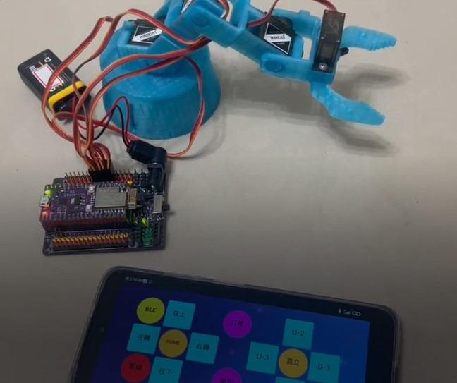

使用 Ameba BW16 晶片的 A1 Gyro 開發板來控制五軸的機械手臂

1. 開發板用的是 A1 Gyro 開發板
- ameba BW16 晶片
- 內建 PCA9685, 提供 16 路 PWM 訊號
- 腳位相容 ESP32

2. 手機控制介面使用 app inventor2 開發，採 BLE 和 A1 Gyro 對接 (只支援 android 手機) 

====================================

